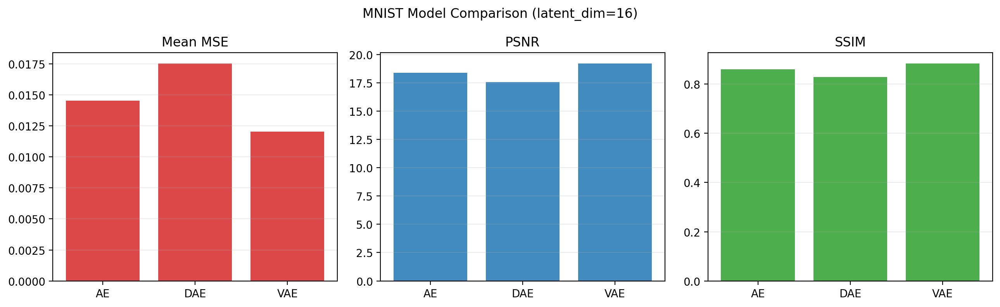
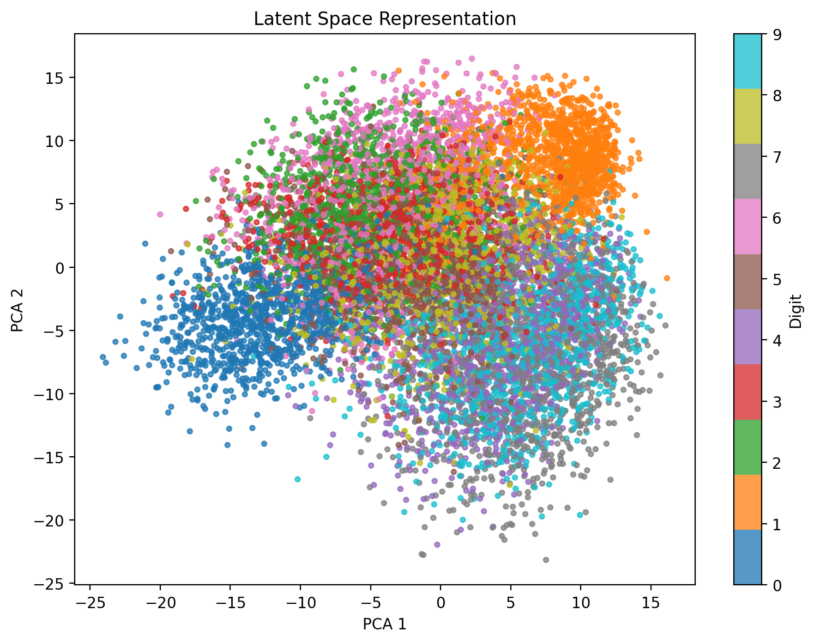
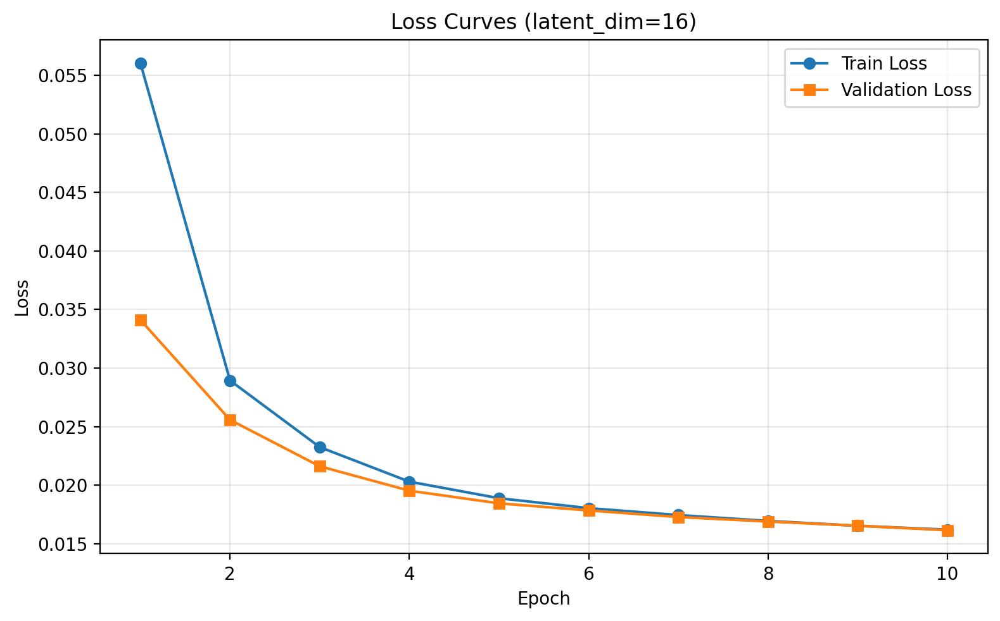
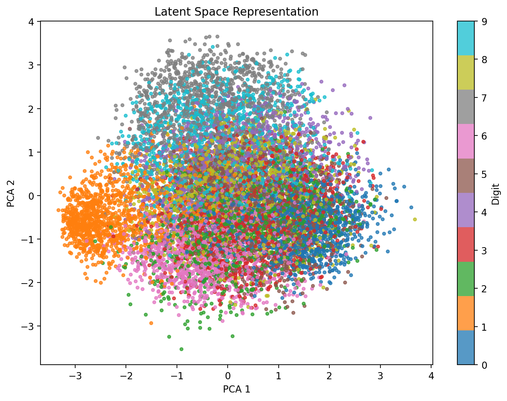
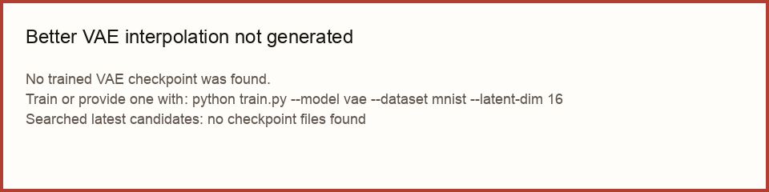
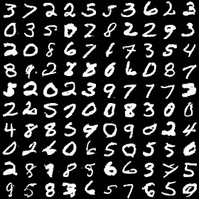
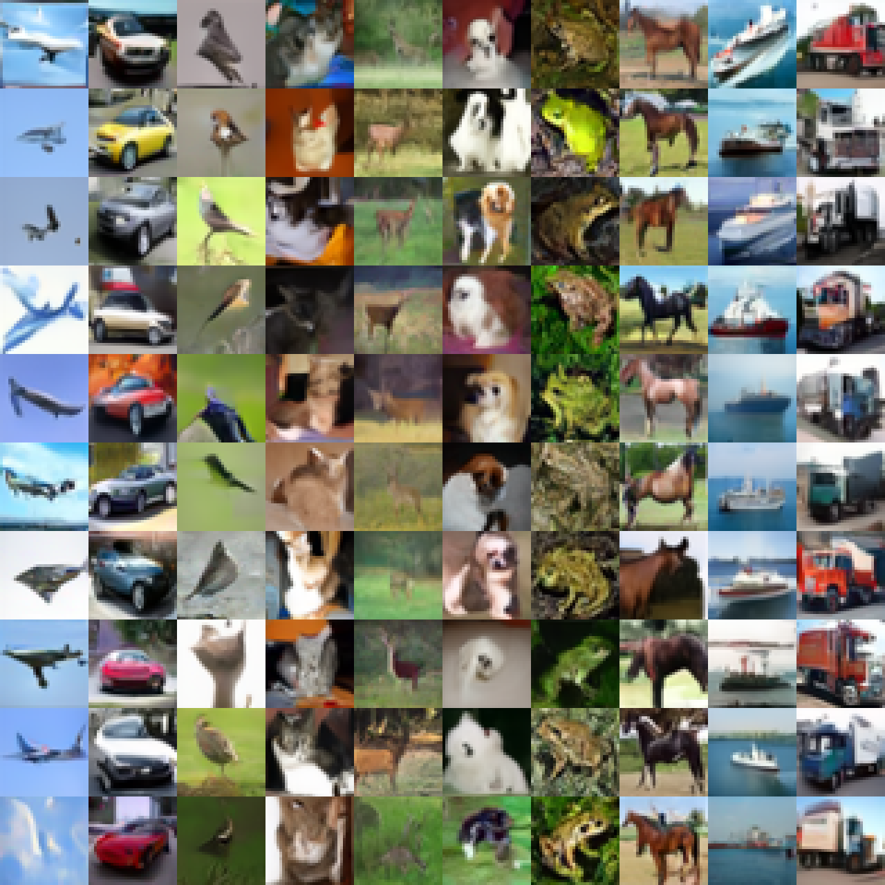

# PCA vs Autoencoders for Image Reconstruction

<link rel="stylesheet" href="./style.css">

## Overview

This CS 472 final project compares classical PCA reconstruction with neural autoencoder reconstruction on MNIST and Fashion-MNIST. PCA assets and the final cross-method analysis are owned by my teammate and will be merged later; this page currently shows the autoencoder-side results plus clear PCA placeholders.

My portion covers regular autoencoders, denoising autoencoders, variational autoencoders, VAE interpolation/generation, and a small diffusion extension. Diffusion is extra credit and is separate from the main PCA vs autoencoder comparison.

## Main Comparison: PCA vs Autoencoder

The final report will compare PCA and autoencoder reconstructions at matched compression levels using visual grids and metrics such as MSE, PSNR, and SSIM. The PCA visuals below are placeholders until teammate results are merged.

### PCA Placeholders


### Current Autoencoder Reference Results





## AE / DAE / VAE Results

The regular autoencoder is the main neural reconstruction baseline against PCA. The denoising autoencoder tests robustness to noisy inputs, and the VAE adds a probabilistic latent space for sampling and interpolation.

### Regular Autoencoder





### Denoising Autoencoder




### Variational Autoencoder





## VAE Interpolation and Generation

The VAE latent space supports smooth movement between examples and random generation from the learned latent distribution.



## Metrics Snapshot

The metric plots below summarize the current autoencoder-side results. PCA metric overlays will be added when teammate outputs are available.


## Extra Credit Extension: Diffusion Model

Diffusion is an extra-credit generative extension, not the main reconstruction comparison. The cleaned workflow keeps diffusion to MNIST and CIFAR-10 only. Fashion-MNIST diffusion runs were removed from the active workflow.

The native grids preserve the original generated sample size. The enlarged grids are pre-scaled with nearest-neighbor interpolation so CIFAR-10 does not look blurred by browser or plotting interpolation.

### MNIST Diffusion

Native 28x28 samples:



Nearest-neighbor 4x display:


### CIFAR-10 Diffusion

Native 32x32 samples:


Nearest-neighbor 4x display:



## Full Analysis Placeholder

The final written conclusions will be added after PCA results are merged:

- PCA vs AE reconstruction quality on MNIST and Fashion-MNIST
- Metric trends by latent dimension or component count
- Where PCA is competitive
- Where AE/DAE/VAE models improve or fail
- Final limitations and recommendations

## How To Reproduce

Autoencoder examples:

```bash
python train.py --model ae --dataset mnist --latent-dim 16
python train.py --model dae --dataset mnist --latent-dim 16 --dae-noise-level 0.2
python train.py --model vae --dataset mnist --latent-dim 16
```

Fashion-MNIST is supported for the autoencoder side:

```bash
python train.py --model ae --dataset fashion --latent-dim 16
```

Diffusion extra-credit configs:

```bash
python train.py --config configs/diffusion/mnist.yaml
python train.py --config configs/diffusion/cifar10.yaml
```

Collect small report images into `docs/assets/`:

```bash
python scripts/collect_report_assets.py
```
